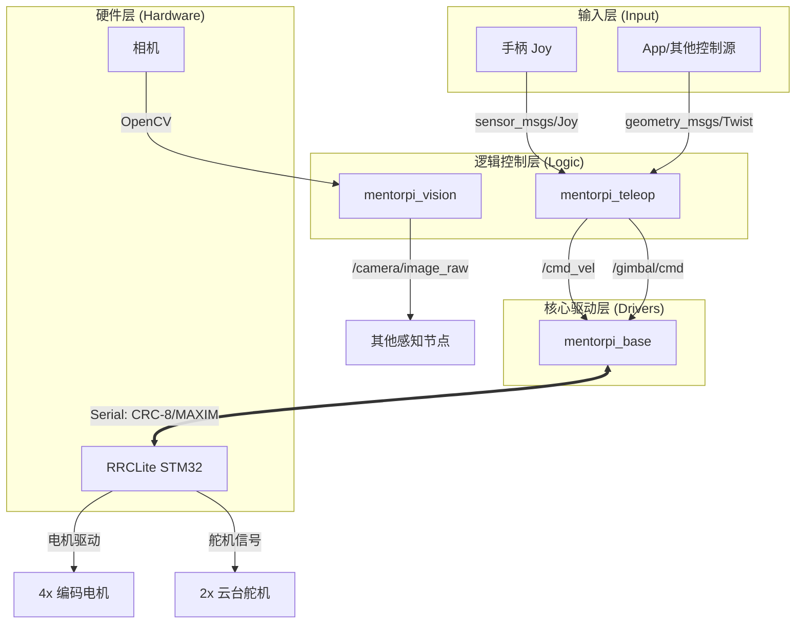

# MentorPi ROS 2 项目开发文档

本项目是一个基于 **ROS 2 Jazzy** 开发的机器人控制系统，适配 **MentorPi** 硬件架构（树莓派 + RRCLite 主控板）。系统集成了 4 轮电机驱动、2 自由度云台控制、相机推流以及手柄远程控制功能。

---

## 1. 系统架构 (System Architecture)

系统采用分层解耦设计，确保硬件更换或功能扩展时只需修改特定模块。

### 1.1 逻辑架构



- **输入层 (Input)**: 手柄 (Joy)、App 指令、AI 算法逻辑。
- **控制层 (Control)**: 负责坐标转换、运动学计算（如差速模型）及指令下发。
- **驱动层 (Driver)**: `mentorpi_base` 节点，负责与 RRCLite 进行串口通信。
- **硬件层 (Hardware)**: RRCLite (STM32) 驱动电机、舵机，并采集 IMU/编码器数据。

### 1.2 软件包说明
| 软件包 | 类型 | 职责 |
| :--- | :--- | :--- |
| `mentorpi_msgs` | ament_cmake | **接口定义**：包含 `Gimbal`（云台）和 `MotorStatus`（电机）自定义消息。 |
| `mentorpi_base` | ament_python | **底层驱动**：实现串口通信与 CRC-8/MAXIM 协议封装。 |
| `mentorpi_teleop` | ament_python | **远程控制**：映射 Joy 手柄数据到运动和云台话题。 |
| `mentorpi_vision` | ament_python | **视觉处理**：发布相机图像流，支持后续 AI 视觉扩展。 |
| `mentorpi_bringup` | ament_python | **系统整合**：包含一键启动的 Launch 文件和全局参数配置。 |

---

## 2. 串口通信协议 (Serial Protocol)

驱动层与 RRCLite 通信采用以下帧格式：
- **帧头**: `0xAA 0x55`
- **校验**: `CRC-8/MAXIM` (Poly: 0x31, Init: 0x00, RefIn: True, RefOut: True)
- **波特率**: `1,000,000 (1M)`
- **控制 ID**:
    - `0x03`: 编码器电机控制（SubCmd 0x01 为多电机控制）。
    - `0x04`: PWM 舵机控制（SubCmd 0x03 为单个舵机控制）。

---

## 3. 快速上手 (Quick Start)

### 3.1 编译
```bash
cd mentorpi_ws
colcon build --symlink-install
source install/setup.bash
```

### 3.2 运行
启动所有核心节点（包含手柄驱动）：
```bash
ros2 launch mentorpi_bringup mentorpi.launch.py
```

---

## 4. 功能扩展指南 (Extension Guide)

### 4.1 接入激光雷达 (Lidar)
1. 安装对应驱动（如 `sllidar_ros2`）。
2. 在 `mentorpi_bringup/launch/mentorpi.launch.py` 中添加雷达 Node。
3. 订阅 `/scan` 话题即可进行 SLAM 建图。

### 4.2 增加 AI 视觉追踪
1. 创建新包 `mentorpi_ai`。
2. 订阅 `/camera/image_raw`。
3. 处理图像后，发布 `Gimbal.msg` 到 `/gimbal/cmd` 话题，实现自动跟随。

### 4.3 导航与路径规划 (Nav2)
1. 在 `mentorpi_base` 中解析编码器反馈，发布 `/odom`（里程计）。
2. 配置 `Nav2` 参数文件。
3. `Nav2` 输出的 `/cmd_vel` 将直接驱动小车运动。

---

## 5. 开发建议
- **串口权限**: 若连接失败，请执行 `sudo chmod 666 /dev/ttyUSB0`。
- **话题调试**: 使用 `ros2 topic list` 和 `ros2 topic echo` 监控实时数据。
- **波特率**: RRCLite 默认波特率较高（1M），请确保连接线质量。
